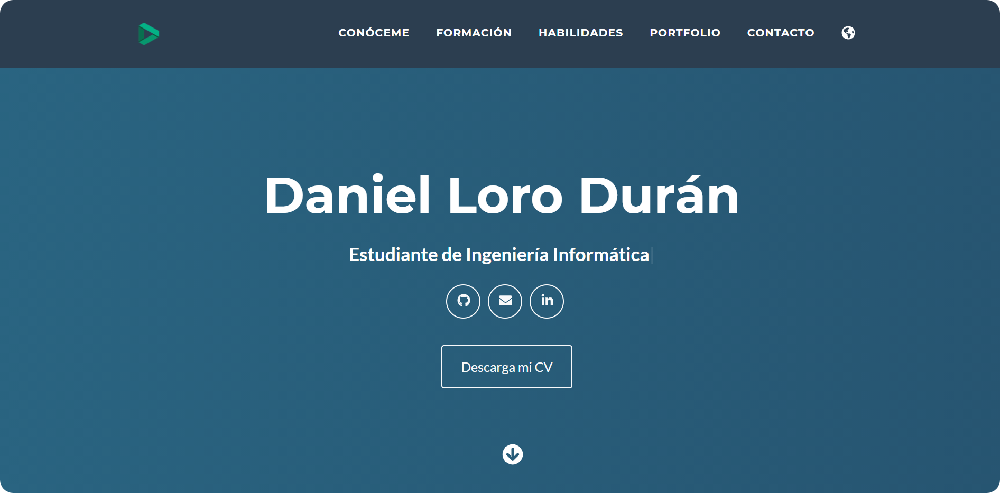

# Sitio web personal 🖥️

  

Pagina web personal en la que me presento, expongo mis conocimientos y formación y sirve para complementar mi CV. Puedes visitarla entrando en http://danielloroduran.github.io EN PRUEBAS

## Posicionamiento en Internet 📊
Utilizando las técnicas y herramientas aprendidas en la asignatura de __Comercio Electrónico__, he intentado mejorar el posicionamiento SEO utilizando:
* __Google Analytics__ para obtener estadísticas de la página web.
* __Google Search Console__ con el que obtener datos sobre la indexación.
* __sitemap__, archivo para hacer más sencilla la tarea del rastreo por parte de los buscadores.
* __robotx.txt__, archivo que ayuda en la toma de información por parte de los buscadores.

## Heramientas 🛠️
* HTML5
* CSS
* Javascript
* Bootstrap 4 (diseño responsive)
